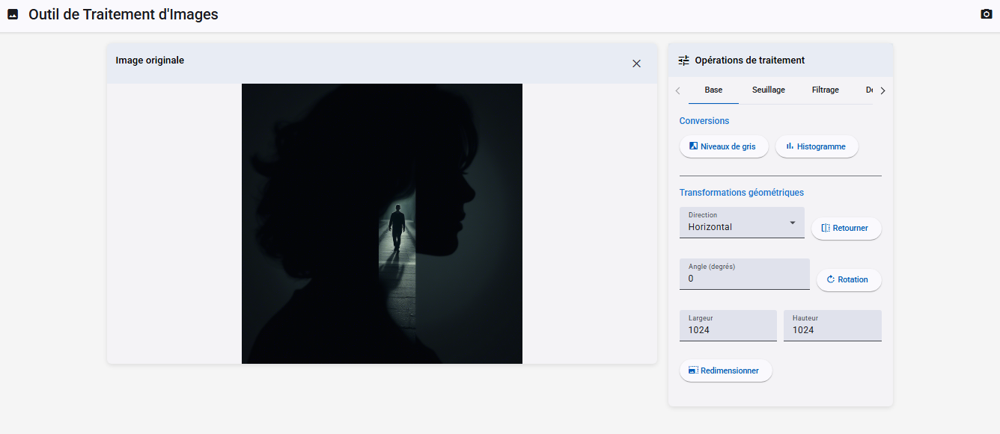
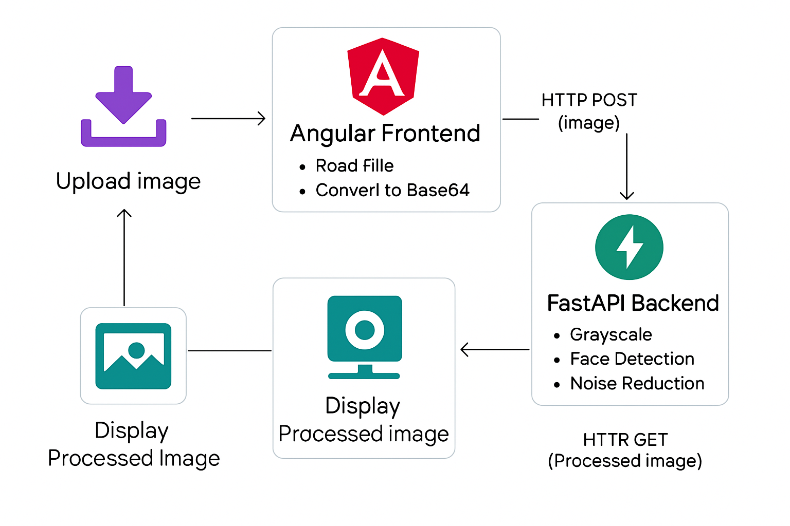

# Image-processing-tool

This project is a web application for image processing built with Angular (frontend) and FastAPI (backend). It allows users to upload an image, apply various processing operations to it, and then view and download the image directly in the web interface.





**Table of Contents**

- [Installation](#installation)
- [Execution](#execution)
- [Technologies](#technologies)
- [Project architecture](#architecture)
- [Features](#features)
- [Author](#author)
- [License](#license)

## Installation :    
### Guide d'Installation Rapide

## Démarrage automatique (Recommandé)

1. **Ouvrir un terminal** dans le répertoire du projet
2. **Exécuter le script de démarrage** :
   ```bash
   ./start.sh
   ```
3. **Attendre** que les serveurs se lancent (environ 30 secondes)
4. **Ouvrir** http://localhost:4200 dans votre navigateur

## Installation manuelle

### Prérequis
- Python 3.11+
- Node.js 20+
- npm

### Backend

```bash
cd backend
```

#### creer un environnement virtuel : 

```bash
python -m venv venv
```
#### activer l'environnement : 

```bash
venv\Scripts\activate
```
#### installer les dependances : 

```bash
pip install -r requirements.txt
```

#### lancer le serveur : 

```bash
uvicorn app:app --reload
```

### Frontend (dans un nouveau terminal)
```bash
cd frontend
```


```bash
npm install
```


```bash
ng serve --host 0.0.0.0 --port 4200
```

## Execution : 

1. **Accéder** à l'application : http://localhost:4200
2. **Télécharger** une image en cliquant sur "Choisir une image"
3. **Sélectionner** une opération dans les onglets
4. **Configurer** les paramètres si nécessaire
5. **Cliquer** sur le bouton de l'opération souhaitée
6. **Télécharger** le résultat avec l'icône de téléchargement


## Dépannage

### Le backend ne démarre pas
- Vérifiez que Python 3.11+ est installé
- Installez les dépendances : `pip install -r requirements.txt`

### Le frontend ne démarre pas
- Vérifiez que Node.js 20+ est installé
- Installez Angular CLI : `npm install -g @angular/cli`
- Installez les dépendances : `npm install`

### L'application ne se connecte pas
- Vérifiez que les deux serveurs sont démarrés
- Backend : http://localhost:8000
- Frontend : http://localhost:4200


## Technologies : 

< Image processing tool > uses the following technologies and tools:

- [Python](https://www.python.org/) 
- [FastAPI](https://fastapi.tiangolo.com/) 
- [Angular](https://angular.io/) 


## architecture :

Below is a simplified diagram that explains how the frontend and backend communicate:



### Details : 

1. The user interacts with the **frontend Angular application** through their web browser.
2. When the user uploads an image, the frontend sends an HTTP request (`POST`) to the **FastAPI backend**.
3. The backend receives the image, processes it (e.g., converts to NumPy array, applies filters, etc.).
4. The processed image is converted to **Base64** format and sent back to the frontend in the HTTP response.
5. The Angular frontend decodes the Base64 image and displays the **result** on the web interface.

This architecture allows for a clean separation between the frontend (UI logic) and the backend (image processing logic).


## Features : 


### Fonctionnalités disponibles


Available Features
### Basic
- Grayscale conversion
- Histogram generation
- Flip (horizontal/vertical)
- Rotation (customizable angle)
- Resizing

### Thresholding
- Global thresholding (with customizable value).
- Adaptive thresholding


### Filtering
- Noise reduction (Gaussian/Median)
- Morphological operations (erosion, dilation, opening, closing)

### Detection
- Edge detection (Canny/Sobel)
- Superpixel segmentation

### Faces
- Face detection
- Anonymization (blur/pixelation)


## Contributors
Elbou Sidina – elboualysidina86@gamil.com

## Author
@ElbouSidina – elboualysidina86@gamil.com

Projet développé dans le cadre du Master IA spécialisé NLP & Computer Vision - Module Traitement d'image avec Python.

## Change log
1.0.0

Version initialewith frontend Angular and backend FastAPI

Upload, traitement, conversion, et affichage d’image opérationnels


## License : 

< iamge-processing-tool> is distributed under the MIT license.


